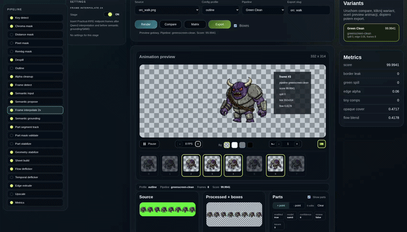

# GPT Image 2 Spritesheet Processor

> [!CAUTION]
>
> **Project status: ARCHIVED.** This repository is preserved as a portfolio
> and reference snapshot and is no longer actively maintained. Some features,
> model integrations or setup steps may not work with current
> dependencies, drivers or external services. No further feature development,
> compatibility updates or ongoing support are planned.

Local-first workbench for turning AI-generated spritesheets into game-ready
transparent animation assets.



## Processing pipeline

The selected profile and pipeline configuration determine which stages are
active. The sequence below shows the available execution order:

1. **Source and pipeline selection** — load a spritesheet, choose a profile
   (`outline`, `thick-outline` or `pixelart`) and select a concrete pipeline.
2. **Key-color detection** — estimate the background key color from the source.
3. **Foreground mask generation** — create an alpha mask using the selected
   strategy: chroma distance, RGB distance, hard pixel-art masking or `rembg`
   segmentation.
4. **Chroma-key background removal** — turn the detected green background
   transparent while preserving the sprite silhouette and semi-transparent
   edges.
5. **Despill** — reduce green color contamination on boundary pixels and make
   residual spill partially transparent.
6. **Outline reconstruction** — detect a dark edge color, then rebuild or
   strengthen the outline around the alpha boundary.
7. **Alpha cleanup** — remove small isolated islands and close unwanted
   pinholes in the mask.
8. **Crop and frame detection** — crop to the foreground bounds, detect
   individual animation frames and calculate their geometry.
9. **Semantic input preparation** — build normalized RGB frame inputs for the
   semantic services while keeping alpha as the source of truth for cropping
   and frame detection.
10. **Semantic proposal** — send the normalized frames to `Qwen3-VL`,
    which proposes parts such as a body, weapon, wings or accessories.
11. **Frame interpolation (`RIFE`)** — use `Practical-RIFE` to insert
    intermediate frames and increase animation smoothness.
12. **Semantic grounding** — validate `Qwen3-VL` hints against the foreground and
    convert accepted boxes and points into explicit segmentation prompts.
13. **Part segmentation and tracking (`SAM3`)** — send frames and
    prompts to create masks and track each semantic part across the animation.
14. **Mask validation** — clip part masks to the base alpha and
    reject masks with invalid geometry or implausible coverage.
15. **Part stabilization** — repair missing masks and smooth
    temporal changes using mobility-aware stabilization settings.
16. **Geometry stabilization** — align frame centroids and anchors to reduce
    sprite wobble between frames.
17. **Spritesheet assembly** — normalize frame sizes and build the output
    spritesheet with consistent padding and frame metadata.
18. **Flow deflickering** — use optical flow to blend only pixels
    that remain temporally consistent.
19. **Temporal deflickering** — reduce shimmer by comparing stable pixels with
    their temporal median and blending them toward that value.
20. **Edge extrusion** — copy visible edge colors into transparent padding to
    reduce texture bleeding in a game engine.
21. **Upscaling** — apply nearest-neighbor scaling or `AuraSR`.
22. **Metrics and preview** — calculate quality metrics, expose debug metadata,
    keep the preview in memory and allow export only after user approval.

## What the application demonstrates

- modular image-processing pipeline driven by JSON configuration;
- multiple masking strategies: chroma, RGB distance, pixel-art and `rembg`;
- frame detection, cropping, outline/despill cleanup and temporal stabilization;
- semantic processing: `Qwen3-VL` proposes parts, `RIFE` interpolates
  frames, and `SAM3` tracks masks for parts such as body, weapon or wings;
- side-by-side pipeline comparison with per-pipeline tweaks and quality score;
- React/Vite UI backed by a typed local API and a Python CLI;
- deterministic tests, configuration validation, linting, formatting and CI.

## Architecture

```text
React/Vite workbench
        │ local API middleware
        ▼
Python pipeline CLI ──► profile + stage registry + pipeline JSON
        │
        ├─ image processing: masks, despill, frames, stabilization, metrics
        ├─ semantic_client ──► OpenAI-compatible Qwen3-VL
        ├─ HTTP ─────────────► SAM3 service
        └─ HTTP ─────────────► Practical-RIFE service
        │
        ▼
in-memory preview ──► user approval ──► explicit export to generated assets
```

The frontend does not contain the processing algorithm. It calls a local Vite
middleware, which validates the request and starts
`asset_pipeline/pipeline_tool.py` as a bounded Python process. `SAM3` and `RIFE`
are separate long-lived services so their model memory and lifecycle stay
isolated from the main pipeline.

The canonical execution order lives in
[asset_pipeline/config/stage_registry.json](asset_pipeline/config/stage_registry.json).
Pipeline profiles and their enabled stages live in
[asset_pipeline/config/pipelines/](asset_pipeline/config/pipelines/).

## Repository layout

| Directory | Responsibility |
| --- | --- |
| `client/` | React/Vite workbench, local API middleware and frontend tests |
| `asset_pipeline/` | Python CLI, image services, pipeline configuration and tests |
| `semantic_client/` | OpenAI-compatible `Qwen3-VL` client and response parsing |
| `sam3_service/` | Long-lived semantic segmentation service |
| `frame_interpolation_service/` | `Practical-RIFE` interpolation service |
| `asset_pipeline/sources/` | Small demonstration spritesheets |
| `.runtime/` | Local runtime state such as editor presets and logs |

## Quick start

Requirements: Linux/macOS, Python 3.12+, Node.js 22+ and npm. The basic
pipeline runs on CPU and does not require model checkpoints.

```bash
./setup_venv.sh
(cd client && npm ci)
./start.sh
```

Open <http://127.0.0.1:5174>. `start.sh`, `status.sh` and `stop.sh` manage the
local workbench. Additional services can be prepared and started separately:

```bash
START_RIFE=1 ./start.sh   # Practical-RIFE, port 8775
START_SAM3=1 ./start.sh   # SAM3, port 8765
```

`Qwen3-VL` is used only when semantic proposal is enabled and an
OpenAI-compatible server is available, by default at
`http://127.0.0.1:1234/v1`. If an auxiliary service is unavailable, the core
pipeline continues in a degraded mode and records a warning.

## CLI example

```bash
.venv/bin/python asset_pipeline/pipeline_tool.py describe
printf '{"pipelineId":"distance-classic","options":{"profile":"outline"}}' | .venv/bin/python asset_pipeline/pipeline_tool.py process --source pirate_outline.png --preview-id debug-distance --preview-storage disk
```

The normal UI keeps previews in memory. `--preview-storage disk` is useful for
debugging; output files are written under
`asset_pipeline/workbench/previews/<preview-id>/`. Approved exports are written
explicitly to `asset_pipeline/workbench/exports/` and
`client/public/assets/generated/`.

More pipeline and CLI details: [asset_pipeline/README.md](asset_pipeline/README.md).

## Development and verification

```bash
.venv/bin/python asset_pipeline/pipeline_tool.py validate-config
.venv/bin/python -m pytest asset_pipeline/tests -q
cd client && npm ci && npm run lint && npm run format:check && npm run test:run && npm run build
```

CI runs configuration validation, Ruff, Python tests, frontend tests and the
production build. Test fixtures use small deterministic spritesheets and do
not require GPU checkpoints.

## Status and limitations

This is a working local prototype/workbench, not a public multi-user service.

- The Vite API binds to localhost and is intentionally not an authentication or
  rate-limited production API.
- GPU/LLM behavior depends on CUDA, drivers, checkpoint availability and the
  selected provider.
- Checkpoint files are not committed; they are downloaded locally and remain
  subject to their upstream
  licenses.

Example images under `asset_pipeline/sources/` are demonstration inputs.

## License and provenance

Original repository code is MIT-licensed; see [LICENSE](LICENSE).
Third-party libraries, models, checkpoints and example-asset notes are listed
in [NOTICE.md](NOTICE.md).
